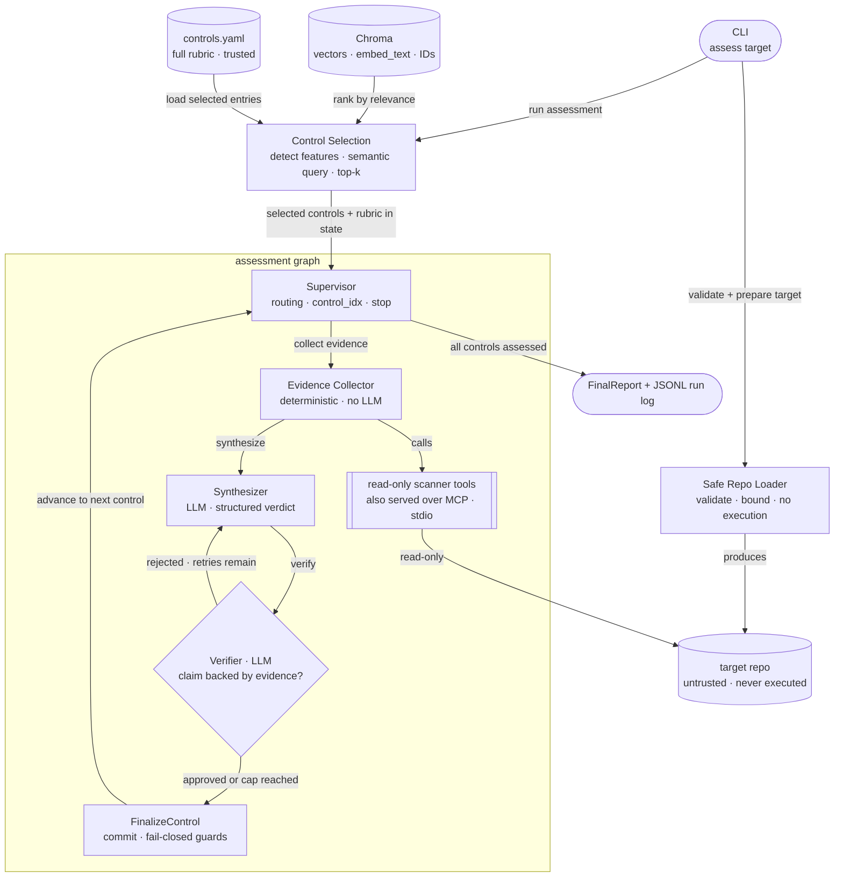

# Agentic Compliance Checker

A self-verifying, multi-agent system that assesses source repositories and IaC against a
**code-detectable subset of NIST 800-53-inspired technical controls**, producing
evidence-backed `satisfied`, `partial`, `gap`, or `not_assessable` verdicts. It is built
on explicit orchestration, deterministic tools, grounded verification, measured
evaluation, and structured observability — not prompt engineering.

Point it at a public GitHub URL (shallow clone, read-only) or a local path. It never
executes repository content. It detects the repo's technology features, selects the most
relevant controls by semantic search over a trusted controls knowledge base, collects
evidence with deterministic read-only scanners, drafts a verdict per control, and runs
every draft through a **verifier loop** that checks each claim against the concrete
scanner evidence — re-synthesizing with the verifier's notes until the claim is grounded
or a hard cap forces a fail-closed downgrade.

## Why this design

A capable LLM asked to "scan this repo for security issues" can find real problems —
but the result is freeform prose whose coverage, provenance, and repeatability are hard
to audit. This system is engineered so that every verdict can be audited and every
failure degrades safely:

- **Explicit, auditable orchestration** — a LangGraph `StateGraph` with typed state and
  conditional edges owns all control flow; there is no opaque agent deciding what to do
  next.
- **Deterministic evidence collection** — facts about the repository come from
  structured, read-only scanner tools (file/line-cited findings), never from LLM
  inference over raw files.
- **Retrieval where it belongs** — semantic search performs dynamic control selection
  over the trusted controls KB; the untrusted target repo is never embedded or
  retrieved.
- **A fail-closed verifier loop** — a second LLM pass rejects unsupported verdicts, and
  two deterministic guards downgrade any affirmative verdict that lacks evidence or
  survives on exhausted retries. A `satisfied` with no scanner evidence behind it
  cannot reach the report.
- **Measured quality** — a human-reviewed golden set of 54 labeled cases and a
  scikit-learn evaluation harness gate quality on macro-F1 (currently 0.933 against a
  0.70 gate).
- **Structured observability** — every run writes a JSONL log of what executed (node
  timing, tool activity, verifier attempts) containing no evidence content and no
  secrets.
- **Safe handling of untrusted input** — URL allowlisting before cloning, no execution
  of repo content ever, symlink-escape and size-cap enforcement, secret masking at the
  scanner layer, and repo text treated as data rather than instructions.

## Architecture



The repo URL or local path enters the **Safe Repo Loader** (not the graph); the loader
validates it and safe-clones only URL inputs, then the graph runs. Only the **Evidence
Collector** reads the target repo, and only through bounded, read-only scanner tools —
the same five functions are also exposed as a FastMCP server over stdio for MCP
clients. The two data sources sit on opposite sides of a trust boundary: **controls KB
trusted, target repo untrusted**. When the verifier cap is reached without a supported
claim, the verdict is **downgraded** — `satisfied` cannot survive verifier failure.

- Component roles and the deterministic-vs-LLM split: [`docs/ARCHITECTURE.md`](docs/ARCHITECTURE.md)
- A single assessment traced end-to-end, with the objects produced at each step:
  [`docs/EXECUTION_FLOW.md`](docs/EXECUTION_FLOW.md)

## How an assessment runs

**Two data sources, two trust levels.** The controls knowledge base is trusted and
static — ingested once (`make ingest`). It has two layers: [`data/controls.yaml`](data/controls.yaml)
holds the structured rubric (requirements, evidence expectations, scanner hints) the
graph reasons over; Chroma holds embedding vectors used solely to rank which controls
are most relevant before assessment starts. The target repository is untrusted, is
never embedded into any vector store, and is inspected read-only through deterministic
scanner tools.

**Control selection (pre-graph).** Two modes, chosen by how much you already know:

- **Dynamic (the default)** — for assessing an unfamiliar repo. `run_assessment()`
  detects technology features from the file tree (Terraform, Dockerfile, GitHub
  Actions, Python, …) plus a bounded read of `.tf` contents to identify specific
  resource types (load balancers, S3 buckets, IAM policies, security groups), builds a
  semantic query, and retrieves the top-k most relevant controls from the persisted
  Chroma KB. The selection — mode, detected features, query, per-control relevance
  scores — is recorded in the final report, so every report explains why its controls
  were chosen.
- **Explicit (`--controls AC-6,SC-8`)** — when the controls of interest are already
  known: re-checking specific controls after a fix, a targeted CI-style check, or the
  evaluation harness (which uses this mode so every golden case gets a prediction for
  exactly the control it names). Retrieval is skipped entirely and Chroma is never
  opened, so no ingested KB is required.

**Per-control flow.** Each selected control passes through three stages:

1. **Evidence Collector** (deterministic, no LLM) — runs the scanners the control's
   hints select: credential patterns, IaC misconfigurations, CI workflow gaps. Findings
   are filtered for relevance to the current control and normalized into structured
   evidence references with file/line citations.
2. **Synthesizer** (LLM) — receives the control's rubric context and the collected
   evidence excerpts, and produces a structured draft verdict with a rationale. The
   evidence attached to the verdict is copied from the collector's output — the LLM
   cannot invent, add, or remove evidence.
3. **Verifier** (LLM) — checks whether the cited evidence actually supports the
   verdict. It makes no tool calls and sees nothing the Synthesizer didn't; rejection
   notes feed the next synthesis attempt.

**Fail-closed guarantees.** If the verifier cap is reached, the verdict is downgraded
to `not_assessable` with the rejection notes preserved. Independently, a deterministic
guard downgrades any affirmative verdict (`satisfied`, `partial`, `gap`) whose scanner
evidence is empty or whose collection hit a tool error — enforced in code, not in a
prompt. The loop is bounded by both a per-control attempt cap and a graph-level
recursion limit.

The full trace — every object at every step, plus failure behavior per stage — is in
[`docs/EXECUTION_FLOW.md`](docs/EXECUTION_FLOW.md).

## Quickstart

Run `make` or `make help` at any time to print the available local and Docker
workflows.

```bash
cp .env.example .env  # set CHAT_MODEL + the matching provider key (embeddings default to local)
```

### Try it locally (venv)

```bash
make venv  # create .venv, install dev deps (Python 3.12+)
make install-agent  # add the agent stack (MCP, LangGraph, RAG)
make test-local  # fast test suite (-m "not agent")
```

Assess a bundled fixture repo or a public URL — no Docker needed either way. Each run
writes a report to `artifacts/local_report.json` and a run log under `artifacts/runs/`
(see "Reports and artifacts" and "Inspect a run" below):

```bash
make ingest-local  # build the controls knowledge base
make assess-local  # dynamic control selection, bundled fixture
make assess-local CONTROLS=AC-6,SC-8 REPO_PATH=tests/fixtures/repos/insecure_terraform_app  # explicit controls
make assess-local REPO=https://github.com/OWNER/REPO  # public repo (REPO takes precedence over REPO_PATH)
```

### Run with Docker

The image runs as non-root; one image carries the whole workflow, including the
FastMCP server, which is runnable in-container over stdio for MCP clients (the assess
path itself calls the scanner functions in-process — no separate service). Reports
land inside Docker's `artifacts` volume, not on the host — see "Reports and artifacts"
below.

```bash
make build  # build the image
make test  # fast test suite (-m "not agent")
make ingest  # build the controls knowledge base
make assess REPO=https://github.com/OWNER/REPO  # dynamic control selection
make assess REPO=https://github.com/OWNER/REPO CONTROLS=AC-6,SC-8  # explicit control selection
make export-artifacts  # copy the Docker report(s) to ./artifacts/docker/ on the host
```

For a richer demo, point it at a vulnerable-by-design public repo such as
[Terragoat](https://github.com/bridgecrewio/terragoat)
(`make assess REPO=https://github.com/bridgecrewio/terragoat`) — expect several
file/line-cited `gap` verdicts, mixed-evidence `partial`s, and masked secrets in the
report. Exact findings may change as the upstream repo changes; it is a demo target,
not a stable benchmark.

### Reports and artifacts

Local CLI runs write reports directly under `artifacts/`. The fixture helper
`make assess-local` defaults to `artifacts/local_report.json` — a separate path from
the CLI's own `artifacts/report.json` default — so a quick fixture run never silently
overwrites a real local assessment.

Docker runs write reports inside Docker's named `artifacts` volume; they do not appear
on the host until exported. **`make export-artifacts` copies the entire volume —
reports, run logs, and eval output — to `artifacts/docker/` on the host**, keeping
Docker-origin artifacts separate from local ones.

The table uses shorthand, not literal commands; see the Local/Docker examples above for
exact invocations (`make assess ...` means `make assess REPO=<url>` plus optional
`CONTROLS=`, `TOP_K=`, `OUT=`, or `FORMAT=`).

| Command | Report path |
|---|---|
| `make assess-local` | `artifacts/local_report.json` |
| `make assess ...` (Docker) | `/app/artifacts/report.json`, inside the volume |
| `make export-artifacts` | `artifacts/docker/` |

### Inspect a run (observability)

The report answers *what the system concluded*; the run log answers *what happened
during the run*. Every assessment run through `run_assessment()` (the CLI's `assess`
subcommand, or any programmatic caller that doesn't override `logger=`) writes a
structured JSONL run log to `artifacts/runs/<run_id>.jsonl` — the CLI prints the exact
path. One line per event: node start/end with timing, one `tool_call` per control
(which scanner families ran; finding/error/limitation counts), one `verifier_attempt`
per verifier call (approved/rejected, whether notes were left), and one
`verdict_finalized` per control.

The log is a security boundary as much as a convenience: every field is structural
(IDs, counts, durations, verdict labels) — never a raw evidence excerpt, repo file
content, verifier rationale text, or exception message. Those live in the report or on
stderr, by design.

A compact audit trail for one control: scanners found one relevant evidence item,
the verifier approved the draft `gap` verdict on the first attempt, and the verdict
was finalized:

```json
{"event": "tool_call", "run_id": "...", "ts": "...", "control_id": "AC-6", "tools": ["terraform"], "evidence_count": 1, "error_count": 0, "limitation_count": 0}
{"event": "verifier_attempt", "run_id": "...", "ts": "...", "control_id": "AC-6", "attempt": 1, "draft_verdict": "gap", "approved": true, "notes_present": true}
{"event": "verdict_finalized", "run_id": "...", "ts": "...", "control_id": "AC-6", "verdict": "gap", "verifier_status": "passed"}
```

Try it against a fixture with several real gaps in one run:

```bash
make assess-local REPO_PATH=tests/fixtures/repos/insecure_terraform_app \
  CONTROLS=AC-3,AC-6,SC-7,SC-28,SC-8
```

(Direct `langgraph dev`/Studio use of the module-level `graph` defaults to a no-op
logger so the dev server doesn't accumulate a log file per hot-reload; both paths
accept an explicit `logger=` override.)

## Evaluation

Quality is measured, not asserted, in two deliberately separated steps:

**Golden set.** Candidate labels are generated by a model *different* from the agent's
own (`make golden-local` / `make golden`), so the system is never graded against its
own opinion, then reviewed by hand and frozen as [`data/golden_set.yaml`](data/golden_set.yaml)
— 54 human-verified cases across nine fixture repositories, covering all four verdict
classes. Generation is an occasional, deliberate data-production step, not part of any
build. Full workflow: [`docs/EVAL_PLAN.md`](docs/EVAL_PLAN.md).

**Evaluation harness.** `make eval-local` (venv) or `make eval` (Docker) runs the real
graph against every golden case and scores verdict accuracy with scikit-learn —
confusion matrix, per-class precision/recall, and **macro-F1 as the quality gate**
(chosen over weighted-F1 because `not_assessable` dominates the dataset and would
otherwise mask minority-class failures). The run exits nonzero below the configured
threshold (default 0.70), writes a JSON metrics report to `artifacts/eval/latest.json`,
and runs on demand only — it makes real model calls. Current measured result:
**macro-F1 0.933** (53/54 correct). Metric definitions, how to read them, and the
run-by-run history: [`docs/EVAL_PLAN.md`](docs/EVAL_PLAN.md).

## Development

Set up once per clone:

```bash
python3 -m venv .venv && source .venv/bin/activate  # Python 3.12+
pip install -e ".[dev,agent,studio]"
pre-commit install  # wire git hooks once per clone
```

The day-to-day loop is the fast test suite plus fixture assessments — the same
commands shown in the Quickstart:

```bash
make test-local    # fast, deterministic, no API keys (-m "not agent")
make assess-local  # run the real graph against a bundled fixture
make format        # ruff format + autofix (the single formatter/linter)
```

**Optional: visual graph debugging.** `langgraph dev` starts an in-memory dev server
and opens LangGraph Studio, which renders the graph topology and lets you step through
nodes, inspect state, and watch the verifier loop:

```bash
langgraph dev  # http://127.0.0.1:2024; reads langgraph.json → agentic_compliance.graph:graph
```

The `langgraph` library itself is a core dependency (the graph runs on it); the dev
*server* and Studio are opt-in debugging tools. State is in-memory and resets on
restart — expected for dev.

**Docker vs. dev server vs. Platform.** Three distinct things:
- The `Dockerfile` here — packages the **CLI** for reproducible one-shot runs ("clone
  and it just works"). The run/ship artifact; not required for development.
- `langgraph dev` — the optional visual debugger above.
- `langgraph build` / LangGraph **Platform** — builds an API *server* image (needs
  Postgres/Redis) to serve the graph as a hosted agent. Intentionally **not used**
  here: the chosen interface is a CLI + report (see [DECISIONS.md D11](docs/DECISIONS.md#d11--interface-cli--rendered-report-no-custom-web-frontend)).

## Documentation

- [`docs/ARCHITECTURE.md`](docs/ARCHITECTURE.md) — components, trust boundaries, the deterministic-vs-LLM split
- [`docs/DECISIONS.md`](docs/DECISIONS.md) — design decisions and rejected alternatives
- [`docs/DEFINITION_OF_DONE.md`](docs/DEFINITION_OF_DONE.md) — completion checklist across implementation, tests, security, and docs
- [`docs/EVAL_PLAN.md`](docs/EVAL_PLAN.md) — golden set, verdict metrics, measured results
- [`docs/EXECUTION_FLOW.md`](docs/EXECUTION_FLOW.md) — one assessment traced end-to-end, object by object
- [`docs/MILESTONES.md`](docs/MILESTONES.md) — the gated build plan the project was developed under
- [`docs/RUBRIC.md`](docs/RUBRIC.md) — the code-detectable control rubric
- [`docs/SPEC.md`](docs/SPEC.md) — system spec, schemas, tools, security requirements
- [`docs/TEST_PLAN.md`](docs/TEST_PLAN.md) — test strategy, markers, fast vs. full lane
- [`docs/THREAT_MODEL.md`](docs/THREAT_MODEL.md) — assets, trust boundaries, threats, and implemented mitigations

## Scope and limitations

**This is not a compliance tool.** It produces code-derived evidence mapped to a subset
of NIST 800-53 Rev. 5 technical control IDs; it does not assess
procedural/organizational controls or certify compliance against NIST 800-53, FedRAMP,
SOC 2, HIPAA, CMMC, or ISO 27001.

It performs point-in-time static analysis of a repository, not continuous monitoring of
live infrastructure. It is restricted to technical controls evidenceable from code/IaC;
procedural controls return `not_assessable`. A passing scan is *evidence*, not an audit
verdict — outputs are decision support, and golden labels are LLM-generated and
human-reviewed rather than certified ground truth.

## License

Apache-2.0 — see [`LICENSE`](LICENSE) and [`NOTICE`](NOTICE). Copyright 2026 Pero Matic.

Provided "as is", without warranty of any kind (LICENSE §7–8). **Not a compliance
tool** — it produces evidence, not assurance; see "Scope and limitations" above. Use at
your own risk.
