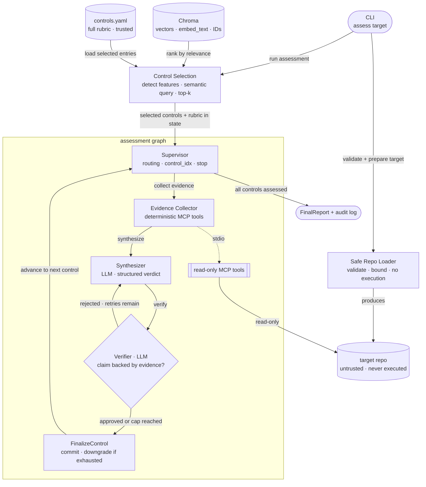

# Agentic Compliance Checker

A self-verifying, multi-agent system that assesses source repositories and IaC against a
**code-detectable subset of NIST 800-53-inspired technical controls**, producing
evidence-backed `satisfied`, `partial`, `gap`, or `not_assessable` verdicts. It uses
explicit orchestration, tools, grounded verification, evaluation, and observability
rather than prompt engineering.

Point it at a public GitHub URL (shallow clone, read-only) or a local path; it
never executes repo content, detects repo technology features and selects the most
relevant controls via semantic search over the knowledge base, runs deterministic
evidence scans against the repo, drafts a verdict per control, and a **verifier loop**
rejects any verdict that isn't backed by concrete scanner evidence — re-synthesizing
with the verifier's notes until the claim is grounded or a cap is hit.

## What it does
Multi-agent orchestration on LangGraph · typed state and explicit control flow · a
conditional verifier self-correction loop · a self-built MCP server for structured
repo analysis · a controls KB with semantic retriever — dynamic control selection detects repo technology features and retrieves the most relevant controls before assessment · deterministic MCP tools over the repo ·
evidence-backed verdicts · a two-layer evaluation harness (grounding + verdict
accuracy) · unit tests and milestone gates · observability · and secure-by-default,
fail-closed ingestion of untrusted repositories.

## Architecture (orientation)



The repo URL or local path enters the **Safe Repo Loader** (not the graph); the loader validates it and safe-clones only URL inputs, then the graph runs. Only the **Evidence Collector** reads the target repo, and only through read-only MCP tools. The two data sources sit on opposite sides of a trust boundary — **controls KB trusted, target repo untrusted**. When the verifier cap is reached without a supported claim, the verdict is **downgraded** — `satisfied` cannot survive verifier failure.

Detailed component diagram and the deterministic-vs-LLM split: [`docs/ARCHITECTURE.md`](docs/ARCHITECTURE.md).

## How it works

**Two data sources, two trust levels.** The controls knowledge base is trusted and static — ingested once (`make ingest`). It has two layers: `data/controls.yaml` holds the structured rubric (definitions, evidence expectations, scanner hints) that the graph reasons over; Chroma holds embedding vectors used to semantically rank and select the most relevant controls before assessment starts. The target repository is untrusted and is never embedded into the vector store; it is inspected read-only through deterministic MCP tools.

**Control selection (pre-graph).** Before the graph starts, `run_assessment()` detects repo technology features from the file tree (Terraform, Dockerfile, GitHub Actions, Python, etc.), plus a bounded read of `.tf` file contents to identify specific Terraform resource types (load balancers, S3 buckets, IAM policies, CloudTrail) for sharper query terms, builds a semantic query from those features, and retrieves the top-k most relevant controls from the persisted Chroma KB. The selected controls — and their full rubric context — enter the graph as the initial `controls` state. Passing `--controls AC-6,SC-8` skips retrieval and uses that explicit list instead.

**Per-control flow.** The Supervisor routes each selected control through three nodes in sequence:

1. **Evidence Collector** (deterministic MCP tools) — runs structured, read-only scanners against the repo: credential patterns, IaC misconfigurations, CI workflow gaps. Evidence facts come from tool outputs, not LLM inference.
2. **Synthesizer** (LLM) — takes control rubric context and evidence refs from the tools and produces a structured `ControlVerdict`: verdict class, rationale, confidence, and file/line citations.
3. **Verifier** (LLM) — checks whether the cited evidence actually supports the verdict. It operates only on what the Synthesizer provided; it makes no new tool calls.

**Verifier loop exit conditions.** If the verifier passes, the verdict moves to `FinalizeControl`. If it fails and attempts remain, the graph routes back to re-synthesize (evidence was already collected; the Synthesizer gets the verifier's rejection notes in its next prompt). If the cap is reached, the verdict is **downgraded** — `verifier_status: "failed"` with notes explaining why the claim was unsupported. There is also a **deterministic fail-closed guard**: any verifier-approved affirmative verdict (`satisfied`, `partial`, `gap`) is downgraded to `not_assessable` if scanner evidence is empty or collection errors occurred — this is enforced in code, not just in a prompt.

## Quickstart

Run `make` or `make help` at any time to print the available local and Docker workflows.

```bash
cp .env.example .env  # set CHAT_MODEL + the matching provider key (embeddings default to local)
```

### Local (venv)

```bash
make venv  # create .venv, install dev deps (Python 3.12+)
make install-agent  # add the agent stack (MCP, LangGraph, RAG)
make test-local  # fast test suite (-m "not agent")
```

Try it against a bundled fixture repo, or a public URL — no Docker needed either way.
The examples below show dynamic selection, explicit control selection, and
URL-based local assessment; each run writes a report to `artifacts/local_report.json`
(see "Reports and artifacts" below):

```bash
make ingest-local  # build the controls knowledge base
make assess-local  # dynamic control selection, bundled fixture
make assess-local CONTROLS=AC-6,SC-8 REPO_PATH=tests/fixtures/repos/insecure_terraform_app  # explicit controls, different fixture
make assess-local REPO=https://github.com/OWNER/REPO  # public repo instead of a fixture (REPO takes precedence over REPO_PATH)
```

### Docker

`make assess` is shown twice below — dynamic (default, semantic top-k) vs. explicit
`--controls` selection. Either way the report is written inside Docker's `artifacts`
volume, not the host — see "Reports and artifacts" below.

```bash
make build  # build the image
make test  # fast test suite (-m "not agent")
make ingest  # build the controls knowledge base
make assess REPO=https://github.com/OWNER/REPO  # dynamic control selection
make assess REPO=https://github.com/OWNER/REPO CONTROLS=AC-6,SC-8  # explicit control selection
make eval  # run the evaluation harness  [M7+]
make export-artifacts  # copy the Docker report(s) to ./artifacts/docker/ on the host
```

The image runs as non-root and spawns the MCP server as an in-container stdio
subprocess (no separate service). Subcommands print an honest "implemented at Mx"
message until that milestone lands, so the container is runnable from day one.

### Reports and artifacts

Local CLI runs write reports directly under `artifacts/`. The fixture helper
`make assess-local` defaults to `artifacts/local_report.json` — a separate path
from the CLI's own `artifacts/report.json` default — so a quick fixture run never
silently overwrites a real local assessment.

Docker runs write reports inside Docker's named `artifacts` volume; they don't
appear on the host until exported. `make export-artifacts` copies them to
`artifacts/docker/` by default, keeping Docker-origin reports separate from
local ones.

The table uses shorthand, not literal commands. See the Local/Docker examples above for exact invocations; for example, `make assess ...` means `make assess REPO=<url>` plus optional `CONTROLS=`, `TOP_K=`, `OUT=`, or `FORMAT=`.

| Command | Report path |
|---|---|
| `make assess-local` | `artifacts/local_report.json` |
| `make assess ...` (Docker) | `/app/artifacts/report.json`, inside the volume |
| `make export-artifacts` | `artifacts/docker/` |

## Develop (langgraph dev)

The inner dev loop is the LangGraph dev server + Studio, not Docker — it hot-reloads and
lets you step through the graph, inspect state, and watch the verifier loop visually.

```bash
python3 -m venv .venv && source .venv/bin/activate  # Python 3.12+
pip install -e ".[dev,agent,studio]"
pre-commit install  # wire git hooks once per clone
langgraph dev  # in-memory server on http://127.0.0.1:2024 + opens LangGraph Studio
```

`langgraph dev` reads `langgraph.json` (which points at the compiled graph,
`src/agentic_compliance/graph.py:graph`), so it works once the graph exists (M5 onward).
State is in-memory and resets on restart — that's expected for dev.

**Docker vs. dev vs. Platform.** Three distinct things, don't conflate them:
- `langgraph dev` — local development/debugging (above). Your day-to-day loop.
- The `Dockerfile` here — packages the **CLI** for reproducible one-shot runs ("clone and
  it just works"). This is the run/ship artifact, not a dev tool, and not required to develop.
- `langgraph build` / LangGraph **Platform** — builds an API *server* image (needs
  Postgres/Redis) to serve the graph as a hosted agent. Intentionally **not used** here:
  the chosen interface is a CLI + report (see `docs/DECISIONS.md` D11), not a server.

## Golden set generation

Golden labels are generated with a model different from the agent's own (`make golden-local`
/ `make golden`), reviewed by hand, then frozen as `data/golden_set.yaml` for the M7
evaluation harness to consume — see `docs/EVAL_PLAN.md` for the full workflow.

## Why this isn't just RAG
A RAG app retrieves documents and writes an answer. Here, semantic retrieval has one
specific role: **control selection** — detecting repo technology features and ranking
which controls are most relevant via Chroma similarity search. Once controls are selected,
their full rubric context (evidence expectations, scanner hints) is loaded deterministically
from the trusted YAML rubric, not retrieved by embedding. The target repo is never embedded
or retrieved; it is inspected by deterministic, read-only MCP tools that return structured
evidence with file paths and line numbers. The LLM reasons over those two bounded inputs,
it does not freely browse the repo. On top of that: explicit graph orchestration, typed
tools, structured state, **a verifier loop that rejects unsupported claims**, metrics, and
milestone-gated tests.

## Build order
Milestone-gated M1→M8 — see [`docs/MILESTONES.md`](docs/MILESTONES.md). Do not advance
a milestone until its tests pass.

## Documentation
- [`docs/ARCHITECTURE.md`](docs/ARCHITECTURE.md) — components, control flow, diagrams
- [`docs/DECISIONS.md`](docs/DECISIONS.md) — design decisions and rejected alternatives
- [`docs/DEFINITION_OF_DONE.md`](docs/DEFINITION_OF_DONE.md) — completion checklist across implementation, tests, security, and docs
- [`docs/EVAL_PLAN.md`](docs/EVAL_PLAN.md) — golden set, verdict metrics (macro-F1), grounding metrics (RAGAS)
- [`docs/MILESTONES.md`](docs/MILESTONES.md) — gated build plan with acceptance checks
- [`docs/RUBRIC.md`](docs/RUBRIC.md) — the code-detectable control rubric
- [`docs/SPEC.md`](docs/SPEC.md) — system spec, schemas, tools, security
- [`docs/TEST_PLAN.md`](docs/TEST_PLAN.md) — test strategy, markers, fast vs full lane
- [`docs/THREAT_MODEL.md`](docs/THREAT_MODEL.md) — STRIDE analysis, trust boundaries, security acceptance tests

## Scope and limitations
**This is not a compliance tool.** It produces code-derived evidence mapped to a subset of
NIST 800-53 Rev. 5 technical control IDs; it does not assess procedural/organizational
controls or certify compliance against NIST 800-53, FedRAMP, SOC 2, HIPAA, CMMC, or ISO 27001.

Point-in-time static analysis of a repo, not continuous monitoring of live infra.
Restricted to technical controls evidenceable from code/IaC; procedural controls
return `not_assessable`. A passing scan is *evidence*, not an audit verdict — outputs
are decision-support, and golden labels are LLM-generated and spot-checked.

## License

Apache-2.0 — see [`LICENSE`](LICENSE) and [`NOTICE`](NOTICE). Copyright 2026 Pero Matic.

Provided "as is", without warranty of any kind (LICENSE §7–8). **Not a compliance tool** —
it produces evidence, not assurance; see "Scope and limitations" above. Use at your own risk.