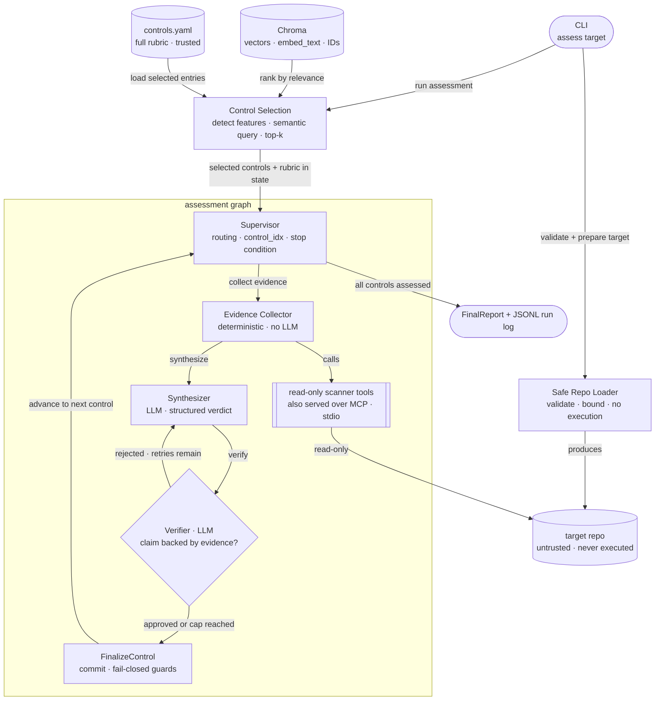
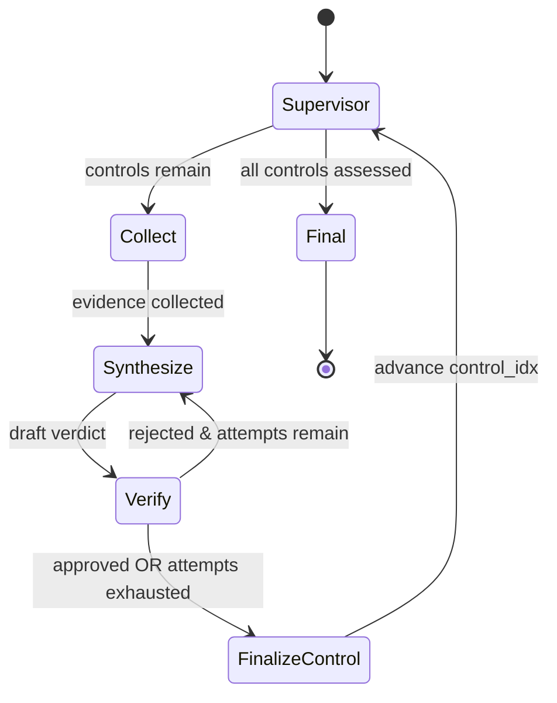

# Architecture

Components, trust boundaries, and the deterministic-vs-LLM split. For a single
assessment traced end-to-end — the object produced at every step — see
[EXECUTION_FLOW.md](EXECUTION_FLOW.md); for security boundaries and mitigations, see
[THREAT_MODEL.md](THREAT_MODEL.md).

## Contents

- [Core design choice](#core-design-choice)
- [Components](#components)
- [Control flow (the verifier loop)](#control-flow-the-verifier-loop)
- [LangGraph](#langgraph)
- [Scanner tools and the MCP server](#scanner-tools-and-the-mcp-server)
- [RAG store](#rag-store)
- [Observability](#observability)

## Core design choice

Deterministic evidence collection is separated from LLM reasoning. The LLM never
inspects arbitrary files or executes repo logic — it receives **structured evidence**
from read-only MCP tools and **pre-loaded control rubric context** from the knowledge
base, then reasons over those. This is what makes verdicts auditable and the system
safe against untrusted input.

## Components

The two data sources are kept on opposite sides of a trust boundary: the **controls
KB is trusted**, the **target repo is untrusted**. The scanner tool layer is the only
code permitted to read repository files, and it returns structured fields, not raw
dumps.

## Control flow (the verifier loop)

`FinalizeControl` commits the verdict, downgrading to `not_assessable` if the verifier
loop was exhausted. Before the graph starts, `run_assessment()` runs **Control Selection**:
it detects repo technology features from the file tree (file extensions and names),
plus a bounded content read of `.tf` files to identify Terraform resource types
(e.g. `aws_lb_listener`, `aws_s3_bucket_public_access_block`) for finer-grained query
terms, builds a semantic query, and retrieves the most relevant controls from the
persisted Chroma KB. The selected controls
and their full rubric context (positive/gap evidence, scanner hints) are loaded into the
initial `ComplianceState` as `controls: list[dict]`. Passing `--controls AC-6,SC-8`
bypasses the retriever and wraps the explicit list instead.

Required conditional behavior:
- Verifier **passes** → `FinalizeControl` commits the verdict, Supervisor advances.
- Verifier **fails and attempts remain** → Synthesize again with verifier notes in prompt.
- Verifier **fails and attempts exhausted** → `FinalizeControl` downgrades to `not_assessable`.

The loop is bounded by **two** independent caps: a `max_verifier_attempts` counter in
state and the LangGraph `recursion_limit`. It can never loop forever.

## LangGraph

`StateGraph` owns all orchestration with explicit typed state (`ComplianceState`) and
conditional edges. LLM nodes (Synthesizer, Verifier) use `init_chat_model` +
`with_structured_output` for Pydantic-validated responses; deterministic nodes
(Collect, FinalizeControl) call Python directly. The supervisor is a no-op routing
node — all control flow is in conditional edge functions. See typed state in
[`docs/SPEC.md`](SPEC.md).

## Scanner tools and the MCP server

Five bounded, read-only tools: `list_repo_files`, `read_file_slice`, `scan_secrets`,
`scan_iac_security`, and `scan_ci_security` ([`tools.py`](../src/agentic_compliance/tools.py)).
Scanner tools return structured `ToolFinding` records; the Evidence Collector
normalizes these into `EvidenceRef` entries before the Synthesizer reasons over them.
None makes a network call; none executes repository content.

The tools have two access surfaces with identical behavior: the assessment path calls
them **in-process** (plain Python imports in [`evidence_collector.py`](../src/agentic_compliance/evidence_collector.py) — no protocol hop
inside a single-process CLI run), and a FastMCP server
([`mcp_server.py`](../src/agentic_compliance/mcp_server.py), **stdio** transport) exposes the same five
functions to external MCP clients. `streamable-http` is the transport option if the
server is ever deployed as a separate service.

## RAG store

The controls KB has two layers with distinct roles and distinct lifecycles:

**`data/controls.yaml`** — the human-authored source of truth. Contains the project
control ID, canonical NIST SP 800-53 Rev. 5 references (`nist_refs`), plain-English
requirement, expected positive/negative evidence, not-assessable notes, and scanner
hints. Read on every `assess` run into an in-memory index; the full
`ControlEntry` objects it produces are what the graph reasons over. Never written by the
tool — edited by hand, diffed in PRs.

**Chroma** (persisted, rebuilt by `ingest-controls`) — stores embedding vectors,
the retrieval text (`embed_text`, a compact summary of the control), and
`{control_id, name}` metadata. The full rubric content — evidence expectations, scanner
hints, not-assessable notes — stays in the YAML; Chroma holds only what is needed for
semantic ranking. Chroma's sole job is **ranking**: during pre-graph control selection,
`ControlsRetriever.search_with_scores()` queries Chroma with a semantic query built from
detected repo features and returns a ranked list of control IDs.

After selection, `retriever.get_by_ids()` pulls the full `ControlEntry` objects from
the in-memory YAML index — **no second Chroma lookup**. The graph only ever sees
content that came from the YAML. Tests inject an in-memory Chroma store with
deterministic fake embeddings; no FAISS, no network.

**When each is used:**
- `ingest-controls`: reads YAML → generates embeddings → writes vectors to Chroma
- `assess --controls AC-6,SC-8` (explicit): reads YAML only — Chroma never opened
- `assess` (dynamic, default): opens Chroma → ranks top-k control IDs → fetches full entries from YAML index
- `assess` (in-graph, both paths): Synthesizer and Verifier receive only YAML-sourced `ControlEntry` content

Retrieval is **hybrid**: semantic over the control text (Chroma, for selection), deterministic/structured over the repo (regex/AST via MCP tools, for evidence). Embedding
Terraform files and hoping for a match is *not* how repo evidence is found — see
[DECISIONS.md D2](DECISIONS.md#d2--hybrid-rag-semantic-over-controls-deterministic-over-the-repo).

**Embeddings are a separate model type from the chat model.** The chat model is freely
swappable (LangChain `init_chat_model`), but switching chat providers doesn't supply an
embedding model, and Anthropic doesn't offer one (Voyage AI is their recommendation).
The default is a local, no-API-key embedding model (`EMBEDDINGS_MODEL=local` →
all-MiniLM-L6-v2 via sentence-transformers) so only one cloud key is needed; OpenAI
`text-embedding-3-small` is the configured alternative. Changing the embedding model
means re-running `ingest-controls` — vectors from different models aren't comparable,
so the KB must be rebuilt.

## Observability

Every assessment run through `run_assessment()` (the CLI's `assess` subcommand and
any default-configured programmatic caller) writes a structured JSONL log to
`artifacts/runs/<run_id>.jsonl` ([`run_log.py`](../src/agentic_compliance/run_log.py)). The
module-level `graph` used by `langgraph dev`/Studio defaults to a no-op logger
instead, so the dev server doesn't accumulate a log file per hot-reload — both
paths accept an explicit `logger=` override. Logged events: node start/end with
timing, one `tool_call`
event per control (scanner families run, finding/error/limitation counts), one
`verifier_attempt` per verifier call (approved/rejected, whether notes were left),
and one `verdict_finalized` per control. Every field is structural — control IDs,
tool names, counts, durations, verdict labels — never a raw evidence excerpt, repo
file content, or the verifier's freeform rationale text; those already live in the
`FinalReport` instead. This is enforced by construction, not by redacting after the
fact: the logging call sites simply never receive evidence content to begin with.
LangSmith traces or OpenTelemetry/Phoenix remain a possible upgrade, not required
for a reviewer to inspect what a run did.
