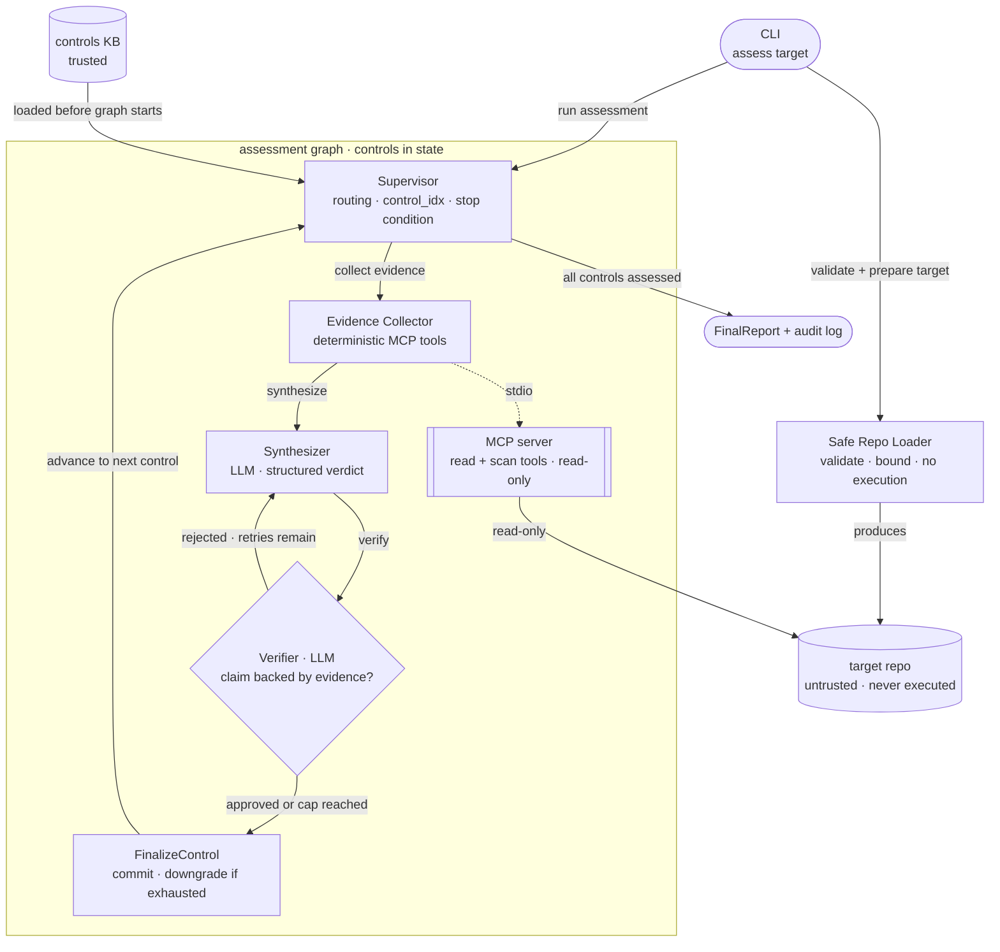
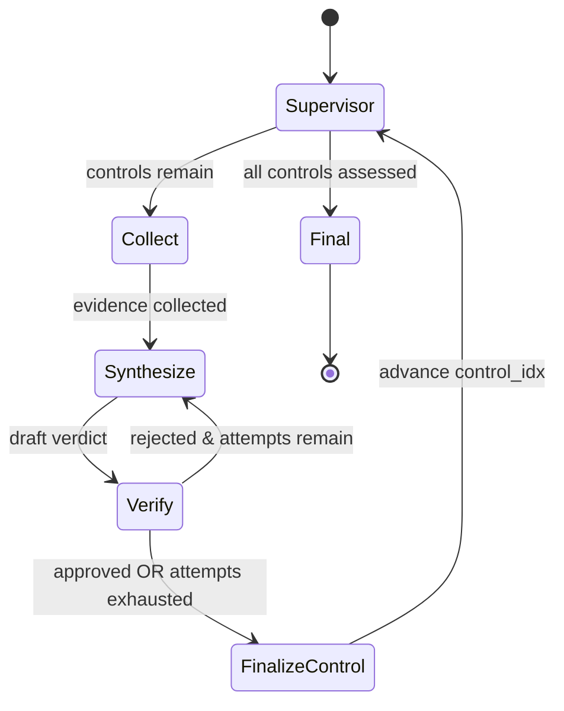

# Architecture

> **Living architecture doc.** The core topology is stable. Component descriptions and
> diagrams update as milestones are implemented — node contracts, state shape, and tool
> schemas fill in as each milestone lands.

## Core design choice

Deterministic evidence collection is separated from LLM reasoning. The LLM never
inspects arbitrary files or executes repo logic — it receives **structured evidence**
from read-only MCP tools and **pre-loaded control rubric context** from the knowledge
base, then reasons over those. This is what makes verdicts auditable and the system
safe against untrusted input.

## Components

The two data sources are kept on opposite sides of a trust boundary: the **controls
KB is trusted**, the **target repo is untrusted**. The MCP server is the only layer
permitted to read repository files, and it returns structured fields, not raw dumps.

## Control flow (the verifier loop)

`FinalizeControl` commits the verdict, downgrading to `not_assessable` if the verifier
loop was exhausted. Control context (positive/gap evidence, scanner hints) is pre-loaded
into graph state from `data/controls.yaml`; semantic retrieval via `ControlsRetriever`
can be wired in as an additional node in a later pass.

Required conditional behavior:
- Verifier **passes** → `FinalizeControl` commits the verdict, Supervisor advances.
- Verifier **fails and attempts remain** → Synthesize again with verifier notes in prompt.
- Verifier **fails and attempts exhausted** → `FinalizeControl` downgrades to `not_assessable`.

The loop is bounded by **two** independent caps: a `max_verifier_attempts` counter in
state and the LangGraph `recursion_limit`. It can never loop forever.

## LangGraph

`StateGraph` owns all orchestration with explicit typed state (`ComplianceState`) and
conditional edges. LLM nodes (Synthesizer, Verifier) use `init_chat_model` +
`with_structured_output` for Pydantic-validated responses; deterministic nodes
(Collect, FinalizeControl) call Python directly. The supervisor is a no-op routing
node — all control flow is in conditional edge functions. See typed state in
[`docs/SPEC.md`](SPEC.md).

## MCP server

Bounded, read-only tools. The initial tool surface is `list_repo_files`, `read_file_slice`,
`scan_secrets`, `scan_iac_security`, and `scan_ci_security`. Scanner tools return structured
`ToolFinding` records; the Evidence Collector normalizes these into `EvidenceRef` entries
before the Synthesizer reasons over them. Recommended transport for local v1 is **stdio**
(spawned as a subprocess by `langchain-mcp-adapters` inside the same container).
`streamable-http` is the option if it's ever deployed as a separate service.

## RAG store

Small, versioned controls KB. **Chroma** with a persist directory is the default
(local, survives restarts); FAISS or an in-memory store is fine for tests. Each KB
entry carries: control ID, family, plain-English requirement, expected positive
evidence, negative evidence, not-assessable notes, and scanner hints.

Retrieval is **hybrid**: semantic over the control text, deterministic/structured over
the repo (regex/AST via MCP tools). Embedding Terraform and hoping is *not* how repo
evidence is found — see [`docs/DECISIONS.md`](DECISIONS.md) D2.

**Embeddings are a separate model type from the chat model.** The chat model is freely
swappable (LangChain `init_chat_model`), but switching chat providers doesn't supply an
embedding model, and Anthropic doesn't offer one (Voyage AI is their recommendation).
Default to a local, no-API-key embedding model (FastEmbed/onnx or sentence-transformers)
so only one cloud key is needed; OpenAI `text-embedding-3-small` is the alternative.
Changing the embedding model means re-running `ingest-controls` — vectors from different
models aren't comparable, so the KB must be rebuilt.

## Observability

Capture per run: request ID, selected controls, node timings, tool calls, verifier
attempts, final verdicts, token/cost estimates when available, and errors. Minimum v1
is structured JSONL logs; LangSmith traces or OpenTelemetry/Phoenix are the upgrade.
Secret values are masked/hashed before they ever reach a log or report.
