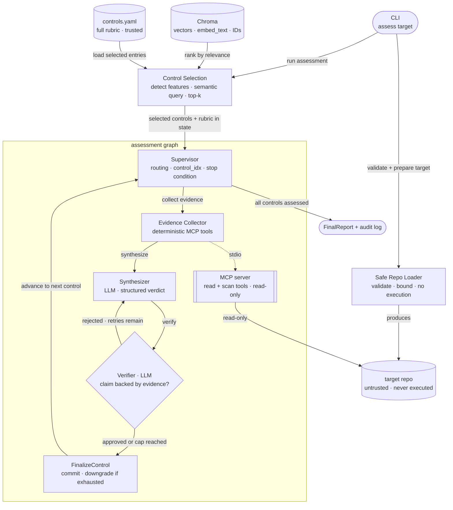
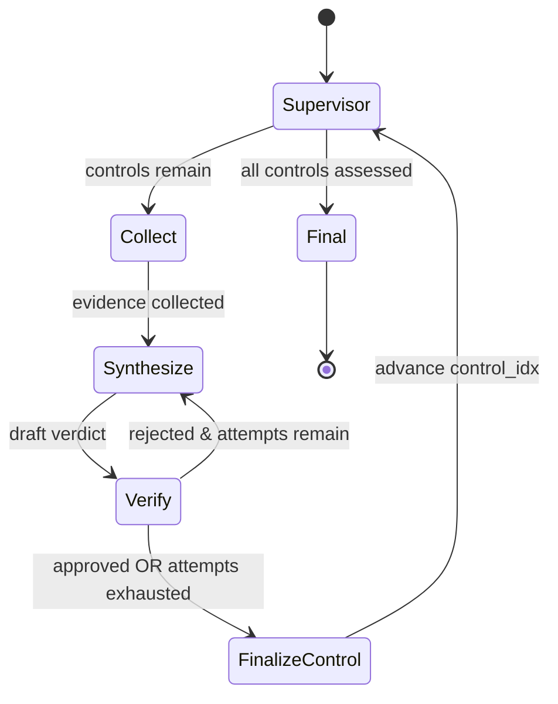

# Architecture

> **Living architecture doc.** The core topology is stable. Component descriptions and
> diagrams update as milestones are implemented — node contracts, state shape, and tool
> schemas fill in as each milestone lands.

## Core design choice

Deterministic evidence collection is separated from LLM reasoning. The LLM never
inspects arbitrary files or executes repo logic — it receives **structured evidence**
from read-only MCP tools and **pre-loaded control rubric context** from the knowledge
base, then reasons over those. This is what makes verdicts auditable and the system
safe against untrusted input.

## Components

The two data sources are kept on opposite sides of a trust boundary: the **controls
KB is trusted**, the **target repo is untrusted**. The MCP server is the only layer
permitted to read repository files, and it returns structured fields, not raw dumps.

## Control flow (the verifier loop)

`FinalizeControl` commits the verdict, downgrading to `not_assessable` if the verifier
loop was exhausted. Before the graph starts, `run_assessment()` runs **Control Selection**:
it detects repo technology features from the file tree (file extensions and names),
plus a bounded content read of `.tf` files to identify Terraform resource types
(e.g. `aws_lb_listener`, `aws_s3_bucket_public_access_block`) for finer-grained query
terms, builds a semantic query, and retrieves the most relevant controls from the
persisted Chroma KB. The selected controls
and their full rubric context (positive/gap evidence, scanner hints) are loaded into the
initial `ComplianceState` as `controls: list[dict]`. Passing `--controls AC-6,SC-8`
bypasses the retriever and wraps the explicit list instead.

Required conditional behavior:
- Verifier **passes** → `FinalizeControl` commits the verdict, Supervisor advances.
- Verifier **fails and attempts remain** → Synthesize again with verifier notes in prompt.
- Verifier **fails and attempts exhausted** → `FinalizeControl` downgrades to `not_assessable`.

The loop is bounded by **two** independent caps: a `max_verifier_attempts` counter in
state and the LangGraph `recursion_limit`. It can never loop forever.

## LangGraph

`StateGraph` owns all orchestration with explicit typed state (`ComplianceState`) and
conditional edges. LLM nodes (Synthesizer, Verifier) use `init_chat_model` +
`with_structured_output` for Pydantic-validated responses; deterministic nodes
(Collect, FinalizeControl) call Python directly. The supervisor is a no-op routing
node — all control flow is in conditional edge functions. See typed state in
[`docs/SPEC.md`](SPEC.md).

## MCP server

Bounded, read-only tools. The initial tool surface is `list_repo_files`, `read_file_slice`,
`scan_secrets`, `scan_iac_security`, and `scan_ci_security`. Scanner tools return structured
`ToolFinding` records; the Evidence Collector normalizes these into `EvidenceRef` entries
before the Synthesizer reasons over them. Recommended transport for local v1 is **stdio**
(spawned as a subprocess by `langchain-mcp-adapters` inside the same container).
`streamable-http` is the option if it's ever deployed as a separate service.

## RAG store

The controls KB has two layers with distinct roles and distinct lifecycles:

**`data/controls.yaml`** — the human-authored source of truth. Contains the project
control ID, canonical NIST SP 800-53 Rev. 5 references (`nist_refs`), plain-English
requirement, expected positive/negative evidence, not-assessable notes, and scanner
hints. Read on every `assess` run into an in-memory index; the full
`ControlEntry` objects it produces are what the graph reasons over. Never written by the
tool — edited by hand, diffed in PRs.

**Chroma** (persisted, rebuilt by `ingest-controls`) — stores embedding vectors,
the retrieval text (`embed_text`, a compact summary of the control), and
`{control_id, name}` metadata. The full rubric content — evidence expectations, scanner
hints, not-assessable notes — stays in the YAML; Chroma holds only what is needed for
semantic ranking. Chroma's sole job is **ranking**: during pre-graph control selection,
`ControlsRetriever.search_with_scores()` queries Chroma with a semantic query built from
detected repo features and returns a ranked list of control IDs.

After selection, `retriever.get_by_ids()` pulls the full `ControlEntry` objects from
the in-memory YAML index — **no second Chroma lookup**. The graph only ever sees
content that came from the YAML. Tests inject an in-memory Chroma store with
deterministic fake embeddings; no FAISS, no network.

**When each is used:**
- `ingest-controls`: reads YAML → generates embeddings → writes vectors to Chroma
- `assess --controls AC-6,SC-8` (explicit): reads YAML only — Chroma never opened
- `assess` (dynamic, default): opens Chroma → ranks top-k control IDs → fetches full entries from YAML index
- `assess` (in-graph, both paths): Synthesizer and Verifier receive only YAML-sourced `ControlEntry` content

Retrieval is **hybrid**: semantic over the control text (Chroma, for selection), deterministic/structured over the repo (regex/AST via MCP tools, for evidence). Embedding
Terraform files and hoping for a match is *not* how repo evidence is found — see
[`docs/DECISIONS.md`](DECISIONS.md) D2.

**Embeddings are a separate model type from the chat model.** The chat model is freely
swappable (LangChain `init_chat_model`), but switching chat providers doesn't supply an
embedding model, and Anthropic doesn't offer one (Voyage AI is their recommendation).
Default to a local, no-API-key embedding model (FastEmbed/onnx or sentence-transformers)
so only one cloud key is needed; OpenAI `text-embedding-3-small` is the alternative.
Changing the embedding model means re-running `ingest-controls` — vectors from different
models aren't comparable, so the KB must be rebuilt.

## Observability

Capture per run: request ID, selected controls, node timings, tool calls, verifier
attempts, final verdicts, token/cost estimates when available, and errors. Minimum v1
is structured JSONL logs; LangSmith traces or OpenTelemetry/Phoenix are the upgrade.
Secret values are masked/hashed before they ever reach a log or report.
