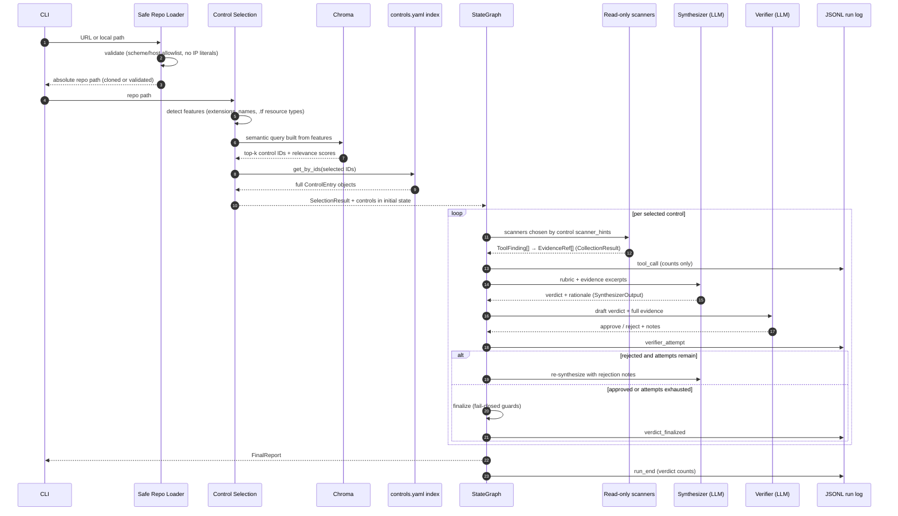

# Execution Flow

Follow one assessment from target input to final report: what happens at each step,
which component does it, and what object it produces. [ARCHITECTURE.md](ARCHITECTURE.md)
describes the components and topology; this document traces a single run through them.

## Contents

- [At a glance](#at-a-glance)
- [Sequence diagram](#sequence-diagram)
- [Stage 1 — Input resolution](#stage-1--input-resolution)
- [Stage 2 — Control selection](#stage-2--control-selection)
- [Stage 3 — Initial state](#stage-3--initial-state)
- [Stage 4 — The per-control loop](#stage-4--the-per-control-loop)
  - [4a. Evidence collection](#4a-evidence-collection)
  - [4b. Synthesis](#4b-synthesis)
  - [4c. Verification](#4c-verification)
  - [4d. Finalization and the fail-closed guards](#4d-finalization-and-the-fail-closed-guards)
- [Stage 5 — Final report](#stage-5--final-report)
- [Stage 6 — The run log](#stage-6--the-run-log)
- [Failure behavior by stage](#failure-behavior-by-stage)
- [Appendix: a worked example](#appendix-a-worked-example)

## At a glance

| Step | Component | Input | Output | Notes |
|---|---|---|---|---|
| Input resolution | [`repo_loader.resolve_repo_input()`](../src/agentic_compliance/repo_loader.py) | URL or local path | absolute `Path` to a local working tree | URL validation before any clone; shallow, no submodules, never executed |
| Control selection | [`control_selection`](../src/agentic_compliance/control_selection.py) + Chroma + YAML rubric | repo file tree | `SelectionResult` (control IDs + relevance scores) + `list[ControlEntry]` | Chroma ranks; `controls.yaml` remains the source of full rubric text |
| State construction | [`graph._initial_state()`](../src/agentic_compliance/graph.py) | selected controls, repo path | `ComplianceState` | run ID, timestamps, model ID; controls serialized into state once |
| Evidence collection | [`evidence_collector`](../src/agentic_compliance/evidence_collector.py) + [scanner tools](../src/agentic_compliance/tools.py) | repo path + control `scanner_hints` | `ToolFinding[]` → `EvidenceRef[]` in a `CollectionResult` | deterministic, read-only, no LLM |
| Synthesis | Synthesizer (LLM) | control rubric + evidence refs | draft `ControlVerdict` | no direct repo access; evidence attached from the collector, never the LLM |
| Verification | Verifier (LLM) | draft verdict + full evidence | `VerifierDecision` (approve/reject + notes) | rejection feeds notes back into re-synthesis |
| Finalization | `finalize_control_node` (deterministic) | draft + verifier state + collection | final `ControlVerdict` | two fail-closed downgrade guards apply here, in code |
| Report | `final_node` | all finalized verdicts | `FinalReport` | verdicts, selection provenance, audit metadata |
| Observability | [`run_log.JSONLRunLogger`](../src/agentic_compliance/run_log.py) | structural events from every node | `artifacts/runs/<run_id>.jsonl` | no evidence excerpts, no secrets, no exception messages |

## Sequence diagram



## Stage 1 — Input resolution

**Component:** `repo_loader.resolve_repo_input()` · **Produces:** an absolute `Path`

A source string containing `://` (or starting with `git@`) is treated as a URL and must
pass `validate_repo_url()` before any network activity: HTTPS only, hostname on a fixed
forge allowlist (`github.com`, `gitlab.com`, `bitbucket.org`), no IP literals, no
embedded credentials, and explicit rejection of `file://`, `ext::`, `ssh://`, `git://`,
and scp-style `git@` syntax. A valid URL is then shallow-cloned (`--depth 1`,
`--no-tags`, `--single-branch`, `--no-local`) with `protocol.ext.allow=never` and
`protocol.file.allow=never` forced at the process level. Hooks, submodules, and install
scripts never run. A local path skips cloning and is validated as an existing, readable
directory.

Everything downstream reads the repository exclusively through two bounded functions in
the same module: `iter_repo_files()` (directory denylist, extension/name allowlist,
symlink-escape checks, 512 KiB size cap, binary detection) and `read_file_slice()`
(root-boundary check, line-cited excerpts). No other code path touches repo content.

## Stage 2 — Control selection

**Component:** `control_selection` + `ControlsRetriever` · **Produces:** `SelectionResult` + `list[ControlEntry]`

Semantic retrieval in this system has exactly one job: deciding *which controls to
assess*. It never touches the target repository's content and never feeds text into an
answer.

1. **Feature detection** (`detect_features`) — two layers. A structural pass classifies
   files by extension and well-known names (`.tf` → terraform, `.github/workflows/*.yml`
   → github_actions, `Dockerfile`, `.py`, …). If Terraform is present, a second bounded
   pass reads `.tf` content (64 KiB cap per file, sourced through `iter_repo_files()` so
   the same symlink/size guarantees apply) for `resource "…"` declarations, mapping
   resource types to sub-features — `aws_lb_listener` → load-balancer/TLS vocabulary,
   `aws_security_group` → network-segmentation vocabulary, and so on.
2. **Query construction** (`build_selection_query`) — each feature contributes a phrase
   of retrieval vocabulary chosen to match the `embed_text` fields in `controls.yaml`.
   No features detected yields a generic security fallback query.
3. **Ranking** (`ControlsRetriever.search_with_scores`) — the query is embedded and run
   against the persisted Chroma store, which holds one vector per control (embedded from
   `embed_text`) plus `{control_id, name}` metadata — nothing else. Chroma returns the
   top-k control IDs with L2 distances, normalized to relevance scores in [0, 1].
4. **Hydration** (`get_by_ids`) — the selected IDs are resolved against the in-memory
   index built from `data/controls.yaml`. The full `ControlEntry` objects — requirement
   text, positive/gap evidence expectations, scanner hints — come from the YAML, not
   from Chroma. The graph only ever reasons over YAML-sourced rubric content.

The outcome is recorded as a typed `SelectionResult` (mode, detected features, the
query string, and per-control scores) that travels into the final report, so every
report explains *why* those controls were chosen. Passing `--controls AC-6,SC-8`
bypasses steps 1–3 entirely (`mode: "explicit"`, no scores, Chroma never opened);
a missing persisted KB in dynamic mode raises immediately — there is no silent
fallback to assessing all controls.

## Stage 3 — Initial state

**Component:** `graph._initial_state()` · **Produces:** `ComplianceState`

One typed state object threads through every node: the resolved repo path, the selected
controls (serialized once — nodes never re-read the rubric from disk), the current
control index, per-control working fields (collection result, draft verdict, verifier
attempt counter and notes), the accumulated verdict list, the `SelectionResult`, and
audit fields (`run_id`, start timestamp, model ID). The `run_id` also names the JSONL
run log file.

## Stage 4 — The per-control loop

The Supervisor node routes: if controls remain, the next one enters
collect → synthesize → verify; when all are done, control passes to the report node.
The loop is bounded twice — a per-control verifier attempt cap (`MAX_VERIFIER_ATTEMPTS`,
default 3) and a graph-wide LangGraph `recursion_limit` backstop — so it cannot run
forever regardless of model behavior.

### 4a. Evidence collection

**Component:** `evidence_collector.collect_evidence()` · **Produces:** `CollectionResult`

Deterministic and LLM-free. The control's `scanner_hints` select which scanners run
(`scan_iac_security`, `scan_ci_security`, `scan_secrets`); each returns structured
`ToolFinding` records (path, line range, finding type, severity, message, control
hints, excerpt, limitations). Two filters make evidence control-specific: the finding's
`check_family` must match the control's scanner hints, and its `control_hints` must
intersect the control's ID (compound IDs like `SI-2/RA-5` match on either part).

Relevant findings are normalized into `EvidenceRef` entries — repo-relative path, line
range, excerpt. Presence findings carry the matched source text; absence findings (for
example, "no container scanner configured in CI") have no matched text, so the
finding's message becomes the excerpt — the absence statement *is* the evidence.
Secrets are masked at the scanner layer before an excerpt exists, so a raw credential
value can never reach the collector, the LLM, the report, or the log.

Tool errors and limitations are recorded in separate fields — a scanner failure
(`errors`) must later force `not_assessable`, while a clean scan that found nothing
(`limitations`) is a legitimate result. A scanner exception is caught and recorded; it
never crashes the run and never silently disappears.

These are the same five functions exposed by the FastMCP server
([`mcp_server.py`](../src/agentic_compliance/mcp_server.py), stdio transport) for external MCP clients; the assessment path calls
them in-process. Both surfaces share identical read-only, no-network, structured-output
behavior.

### 4b. Synthesis

**Component:** Synthesizer (LLM, structured output) · **Produces:** draft `ControlVerdict`

The Synthesizer's prompt contains exactly: the control's ID and name, its
positive-evidence and gap-evidence expectations from the rubric, every `EvidenceRef`
excerpt (truncated per item), any tool errors and limitations, and — on a retry — the
verifier's rejection notes from the previous attempt. It does not see the repository,
the file system, or anything the collector did not produce.

The model returns a `SynthesizerOutput` (verdict class, rationale, confidence) via
Pydantic-validated structured output. The graph then merges it into a `ControlVerdict`
whose `evidence` field is copied from the `CollectionResult` — the LLM's output cannot
add, remove, or alter evidence, only interpret it. Verdict semantics: `satisfied`
requires concrete confirming evidence; `gap` requires concrete failure evidence;
`partial` is for genuinely mixed evidence (a confirming finding and a failure finding
under the same control); `not_assessable` is for insufficient evidence or tool errors.

### 4c. Verification

**Component:** Verifier (LLM, structured output) · **Produces:** `VerifierDecision`

The Verifier receives the draft verdict, its rationale, and the *full* evidence list,
and answers one question: is this verdict grounded in this evidence? It rejects
rationales that go beyond or contradict the scanner evidence, affirmative verdicts
without concrete support, and one-sided verdicts that ignore the other half of mixed
evidence. It makes no tool calls and gathers no new information — it is a check, not a
second investigator.

On rejection with attempts remaining, the graph routes back to the Synthesizer with the
rejection notes appended to the next prompt. On approval — or when the attempt cap is
reached — control passes to finalization.

### 4d. Finalization and the fail-closed guards

**Component:** `finalize_control_node` (deterministic) · **Produces:** final `ControlVerdict`

Two downgrade guards run here, in code — not in a prompt, and not subject to model
judgment:

1. **Evidence guard.** Any affirmative verdict (`satisfied`, `partial`, or `gap`) with
   empty scanner evidence or any collection error is downgraded to `not_assessable`,
   regardless of what the Synthesizer concluded or the Verifier approved.
2. **Exhaustion guard.** If the verifier cap was reached without approval, the verdict
   is downgraded to `not_assessable` with the accumulated rejection notes preserved in
   the rationale.

The result is appended to the state's verdict list, the control index advances, and the
per-control working fields reset. An unsupported `satisfied` cannot survive this node.

## Stage 5 — Final report

**Component:** `final_node` · **Produces:** `FinalReport`

The report contains every finalized `ControlVerdict` (verdict, rationale, confidence,
verifier status and attempt count, and the scanner-sourced evidence with file/line
citations), the `SelectionResult` explaining how the controls were chosen, and an audit
block (run ID, start time, model ID, per-class verdict counts). The CLI serializes it
to JSON or Markdown under `artifacts/`.

## Stage 6 — The run log

**Component:** `run_log.JSONLRunLogger` · **Produces:** `artifacts/runs/<run_id>.jsonl`

The report answers *what the system concluded*; the run log answers *what happened
during the run*. Every node is wrapped with start/end timing events, and the graph
emits one `tool_call` per control (which scanner families ran; finding, error, and
limitation counts), one `verifier_attempt` per verifier call (attempt number, draft
verdict, approved or rejected, whether notes were left), one `verdict_finalized` per
control, and `run_start`/`run_end` bookends with verdict totals.

Every field is structural — IDs, names, counts, durations, verdict labels. Evidence
excerpts, repo file content, verifier rationale text, and exception messages never
enter the log; failures record only the exception's class name. This is enforced by
construction (the logging call sites are never handed evidence content), not by
after-the-fact redaction.

## Failure behavior by stage

The system degrades toward `not_assessable`, never toward `satisfied`:

| Failure | Behavior |
|---|---|
| Invalid or disallowed URL | rejected before any network activity; no clone attempted |
| Missing persisted KB (dynamic selection) | immediate error instructing `ingest-controls`; no fallback to all controls |
| Unknown explicit control ID | immediate CLI error listing the unknown IDs |
| Scanner exception | recorded in `CollectionResult.errors`; run continues; evidence guard forces `not_assessable` for that control |
| No relevant evidence found | recorded as a limitation; affirmative verdicts are blocked by the evidence guard |
| Verifier rejects repeatedly | attempt cap reached → downgraded to `not_assessable` with the rejection notes preserved |
| Graph-level runaway | LangGraph `recursion_limit` hard-stops the run |
| Any node exception | logged as a structural `node_error` event (type name only) and re-raised — never swallowed |

## Appendix: a worked example

One control traced with real objects: the bundled fixture
[`partial_network_app`](../tests/fixtures/repos/partial_network_app) assessed against
**SC-7 (boundary protection)** — the mixed-evidence case, where one network tier is
configured correctly and another is not. Everything below except the model output is
deterministic and reproducible with:

```bash
make ingest-local
make assess-local REPO_PATH=tests/fixtures/repos/partial_network_app
```

**Stage 2 — control selection.** Feature detection finds `.tf` files, then the bounded
content pass finds `aws_security_group`/`aws_subnet`/`aws_vpc` resource declarations:

```text
detected_features: [terraform, terraform_network]
```

The query built from those features ranks SC-7 first — the network sub-feature's
vocabulary (boundary protection, segmentation, security groups) is what pulls it to
the top:

```text
SC-7: 0.708   IA-5: 0.481   AC-3: 0.435   SC-28: 0.427   SI-4: 0.348   AC-6: 0.331
```

**Stage 4a — evidence collection.** SC-7's scanner hints select the IaC scanner; two
findings survive the relevance filter and normalize into `EvidenceRef` entries — one
gap (database tier open to the internet), one positive (application tier scoped to a
security group):

```json
{"source_type": "tool_result", "path_or_id": "main.tf", "start_line": 62, "end_line": 62, "excerpt": "cidr_blocks = [\"0.0.0.0/0\"]"}
{"source_type": "tool_result", "path_or_id": "main.tf", "start_line": 46, "end_line": 46, "excerpt": "security_groups = [aws_security_group.web.id]"}
```

`errors: []`, `limitations: []` — a clean collection with genuinely mixed evidence.

**Stages 4b–4d — synthesis, verification, finalization.** The Synthesizer receives
SC-7's rubric expectations plus exactly those two excerpts, and the mixed evidence
should produce `verdict: "partial"`. A representative rationale (model output —
illustrative, not contractual; exact wording varies by run and model):

> "Scanner evidence is mixed. One resource references a security group … consistent
> with boundary protection; however, another rule allows ingress from 0.0.0.0/0 …"

The Verifier approves (the verdict cites both sides of the evidence), and
finalization commits it — the evidence guard passes because concrete scanner evidence
exists and no tool errored. The finalized `ControlVerdict` carries: `control_id:
"SC-7"`, `verdict: "partial"`, the two `EvidenceRef` entries above (copied from the
collector — never model-authored), the rationale, `verifier_status: "passed"`, and
`attempt: 1`.

**Stage 6 — the run log** records the control's passage structurally (timings vary):

```json
{"event": "tool_call", "control_id": "SC-7", "tools": ["terraform", "kubernetes_yaml"], "evidence_count": 2, "error_count": 0, "limitation_count": 0}
{"event": "verifier_attempt", "control_id": "SC-7", "attempt": 1, "draft_verdict": "partial", "approved": true, "notes_present": true}
{"event": "verdict_finalized", "control_id": "SC-7", "verdict": "partial", "verifier_status": "passed"}
```

Note what is *absent* from the log: the `0.0.0.0/0` excerpt, the file content, and the
rationale text — those live in the report, not the log.
